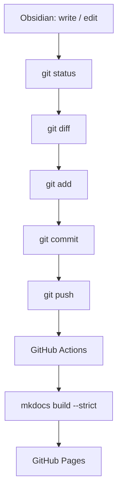

# Git Workflow

## The normal loop



## Commands

```bash
# What changed?
git status

# What exactly changed? Read this before committing — it is the moment
# you notice a pasted API key or a file you did not mean to touch.
git diff

# Stage. Paths with spaces must be quoted.
git add "03-Concepts/Distributed-Systems/Consensus/Raft.md"
git add 01-Roadmap/current-week.md

# Or stage everything, having read the diff:
git add -A

git commit -m "Raft: write My Understanding section after Lab 3B"
git push
```

Two minutes later the site rebuilds. Check the Actions tab if it does not.

## Commit messages

A commit is a study log entry. Write it so the history is readable in a year.

```text
Raft: write My Understanding after finishing Lab 3B
Lab 02: record actual results — fixed-interval retries were worse than none
Week 5: add Replication and Quorum notes
ADR-0002: accept the outbox pattern over dual writes
Roadmap: slip Month 3 by one week
```

Not `update`, `wip`, `notes`, or `.`.

**Commit frequency:** once per study session is a good default. Commit a
finished thought rather than a finished file — that is what makes
`git log -p "path/to/note.md"` a useful record of how your understanding
changed.

## Branching

Work directly on `main`. This is a single-author knowledge base; branches add
ceremony and no safety.

Use a branch when a change is genuinely structural and you want CI to verify it
before it goes live:

```bash
git checkout -b restructure-messaging-concepts
# ... work, commit ...
git push -u origin restructure-messaging-concepts
gh pr create --fill
```

The workflow builds the site on pull requests without deploying, so a broken
link is caught before it reaches `main`.

## What must never be committed

The [`.gitignore`](https://github.com/02david20/distributed-systems-learning-resources/blob/main/.gitignore)
covers these, but the rules are worth knowing:

| Category | Examples | Why |
| --- | --- | --- |
| **Secrets** | `.env`, `*.pem`, `id_rsa`, `*.tfvars`, `kubeconfig`, `credentials.json` | Committed secrets are compromised secrets — history is forever |
| **Build output** | `site/` | Generated by MkDocs; regenerated on every build |
| **Obsidian per-machine state** | `.obsidian/workspace.json`, `.obsidian/cache` | Changes every time a pane is moved; pure diff noise |
| **Third-party plugin code** | `.obsidian/plugins/` | Someone else's JavaScript; reinstall per machine |
| **OS metadata** | `.DS_Store`, `Thumbs.db` | Noise |
| **Python environments** | `.venv/`, `__pycache__/` | Machine-specific, large |

### The `.obsidian` directory: what to version

**Do not ignore `.obsidian` wholesale.** Some of it is genuinely useful to
version, and losing it means every clone behaves differently.

| File | Version it? | Reason |
| --- | --- | --- |
| `app.json` | **yes** | Link format, template folder. **If this is not versioned, links break** — a clone with wiki-links enabled writes `[[Raft]]` and MkDocs cannot resolve it |
| `core-plugins.json` | **yes** | Which core features are on |
| `templates.json` | **yes** | Points at `99-Templates/` |
| `appearance.json` | **yes** | Small, stable, harmless |
| `hotkeys.json` | **yes** | Small; shared shortcuts |
| `community-plugins.json` | yes | The *list* of plugins, not their code |
| `workspace.json` | **no** | Which panes are open. Changes constantly |
| `workspace-mobile.json` | **no** | Same, for mobile |
| `graph.json` | **no** | Graph view camera position |
| `plugins/` | **no** | Third-party code; also may contain plugin state |
| `cache`, `*.json` caches | **no** | Regenerable |

The principle: **version the settings that make the repository behave
consistently; ignore the settings that describe one person's screen.**

## If a secret is committed

Assume it is compromised the moment it is pushed.

1. **Rotate the credential first.** Revoke it at the provider. Do this before
   touching Git.
2. Then clean the history if you want to
   ([`git filter-repo`](https://github.com/newren/git-filter-repo) or
   [BFG](https://rtyley.github.io/bfg-repo-cleaner/)).
3. Force-push, and treat any fork or clone as still holding the secret.

Removing a secret from history does not un-leak it. Step 1 is the one that
matters.

## Sanity checks before pushing

```bash
# Look for obvious secret shapes in what you are about to commit
git diff --cached | grep -nEi '(api[_-]?key|secret|password|token|BEGIN [A-Z ]*PRIVATE KEY)'

# Confirm the site still builds — CI runs exactly this
mkdocs build --strict
```

## Syncing across machines

```bash
git pull --rebase        # before starting work
# ... work ...
git push                 # after
```

`--rebase` keeps the history linear, which matters when the same note is edited
on two machines.

**Conflicts** in Markdown resolve like any text conflict: edit the file, remove
the markers, `git add`, `git rebase --continue`. Obsidian will show the
conflict markers as ordinary text, so they are easy to spot.

The habit that avoids nearly all conflicts: **pull before you start, push when
you stop.**
