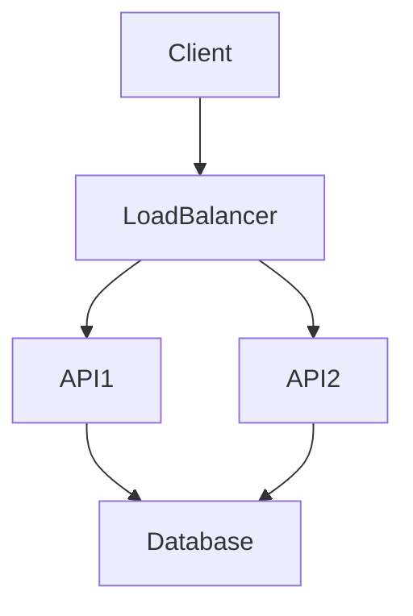
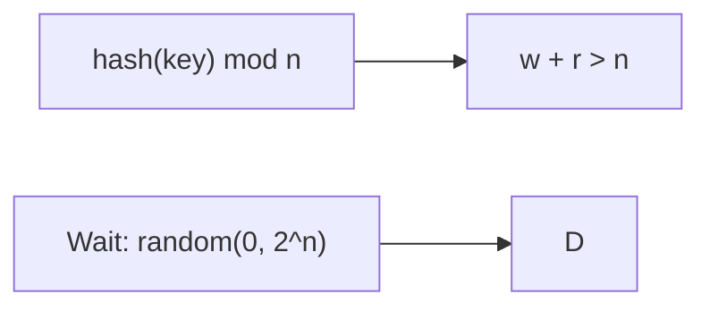
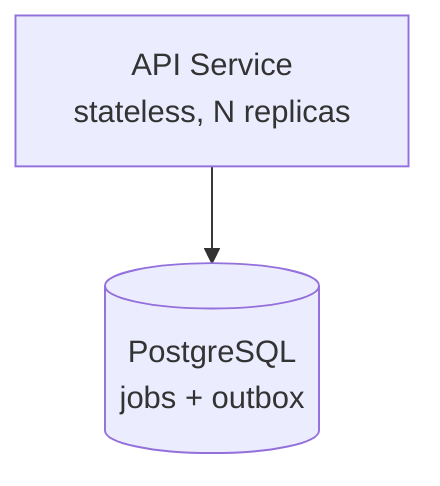
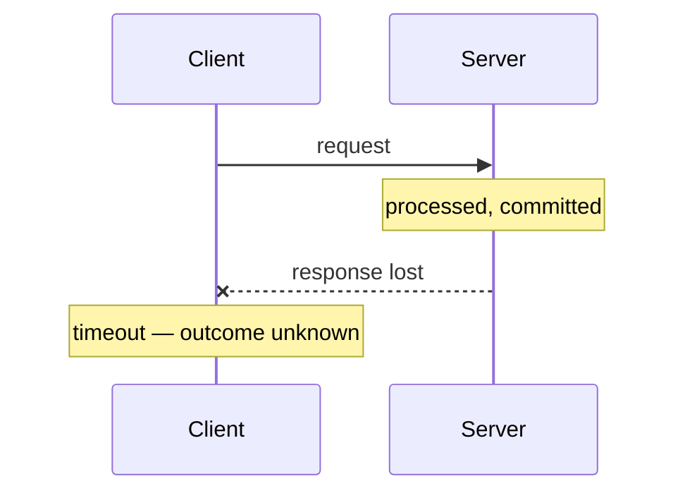
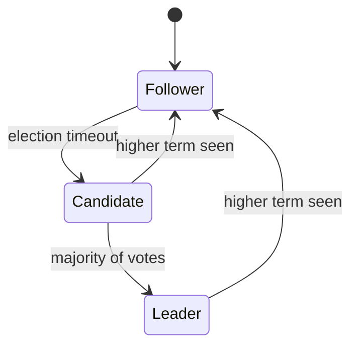
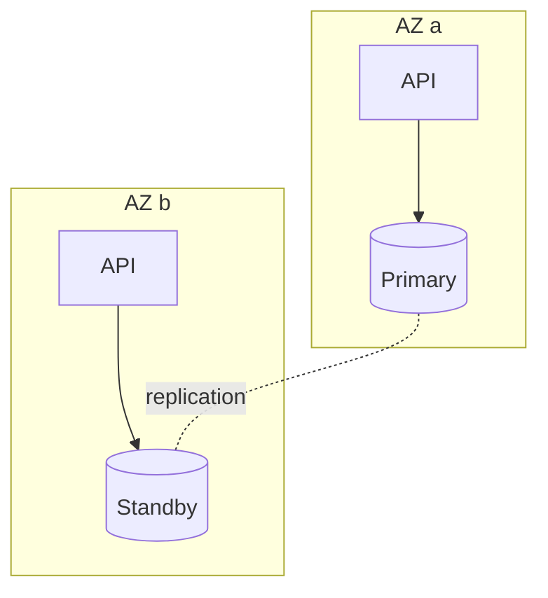

# Mermaid Diagrams

Diagrams are written as [Mermaid](https://mermaid.js.org/) in fenced code
blocks. They render in **Obsidian** (built in, no plugin) and in **MkDocs
Material** (configured in `mkdocs.yml`), stay diffable in Git, and require no
binary assets.

## Writing one

Type a fenced block tagged `mermaid`:

````markdown

````

Which renders as:


### In Obsidian

Preview mode (`Cmd/Ctrl + E`) renders it live. Live Preview renders it as you
type. There is nothing to install — Mermaid ships with Obsidian.

### On the site

`mkdocs.yml` registers a custom fence so the same block renders with Material's
bundled Mermaid:

```yaml
markdown_extensions:
  - pymdownx.superfences:
      custom_fences:
        - name: mermaid
          class: mermaid
          format: !!python/name:pymdownx.superfences.fence_code_format
```

Material handles theming, so diagrams follow the site's light/dark mode
automatically.

## Compatibility

Obsidian and MkDocs Material bundle **different Mermaid versions**. Almost
everything works in both; a few newer diagram types may render in one and not
the other.

| Diagram type | Obsidian | MkDocs Material |
| --- | --- | --- |
| `flowchart` / `graph` | ✅ | ✅ |
| `sequenceDiagram` | ✅ | ✅ |
| `stateDiagram-v2` | ✅ | ✅ |
| `classDiagram` | ✅ | ✅ |
| `erDiagram` | ✅ | ✅ |
| `gantt` | ✅ | ✅ |
| `pie` | ✅ | ✅ |
| `mindmap`, `timeline`, `quadrantChart` | version-dependent | version-dependent |
| `%%{init: ...}%%` directives | inconsistent | inconsistent |

**Rule: stick to the first seven.** They cover every diagram this knowledge base
needs, and they have rendered identically for years. Always check a diagram in
both before committing — `mkdocs serve` in one window, Obsidian in the other.

## Syntax that avoids trouble

### Quote any label with punctuation

Parentheses, colons, commas and slashes confuse the parser.



### Multi-line labels use `<br/>`



### Node shapes carry meaning

| Syntax | Shape | Used for |
| --- | --- | --- |
| `A[Text]` | Rectangle | Service, process |
| `A[(Text)]` | Cylinder | Data store |
| `A((Text))` | Circle | External actor |
| `A{Text}` | Diamond | Decision |
| `A[[Text]]` | Subroutine | Subsystem |

### Arrows

```text
A --> B          solid
A -.-> B         dotted — failure paths, removed paths
A ==> B          thick — emphasis
A -->|label| B   labelled
A -.text.- B     dotted with text, no arrowhead
```

## Patterns worth reusing

### Sequence diagram with a lost message

`--x` draws a message that does not arrive — the single most useful notation in
distributed systems.



### State machine



### Grouping with subgraphs



Quote subgraph titles that contain spaces.

## When not to use Mermaid

- **Precise network or infrastructure diagrams** — Mermaid's automatic layout
  will fight you. Use a drawing tool and commit an SVG
- **Very large diagrams** — more than ~20 nodes becomes unreadable. Split it
- **Screenshots and photographs** — obviously

For a hand-drawn diagram, the Obsidian **Excalidraw** plugin is excellent, but
it stores drawings in its own format. If you use it, export an SVG alongside
and reference the SVG, so the diagram survives without the plugin.

## Reference

Reusable diagrams for this repository live in
[06-Architecture/Diagrams](../06-Architecture/Diagrams/README.md).
The [Mermaid documentation](https://mermaid.js.org/intro/) and its
[live editor](https://mermaid.live/) are the fastest way to debug syntax.
